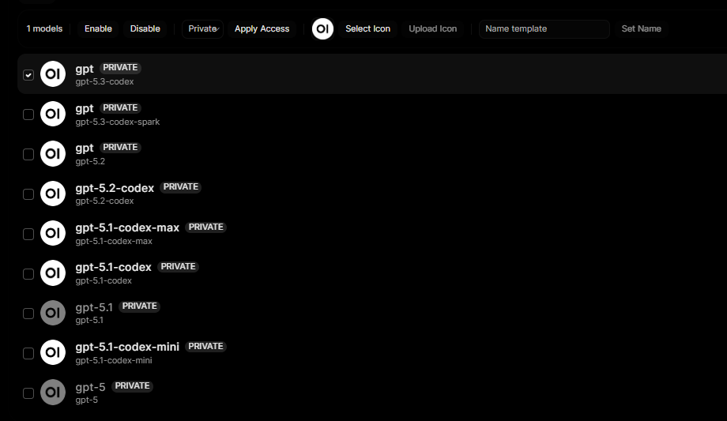
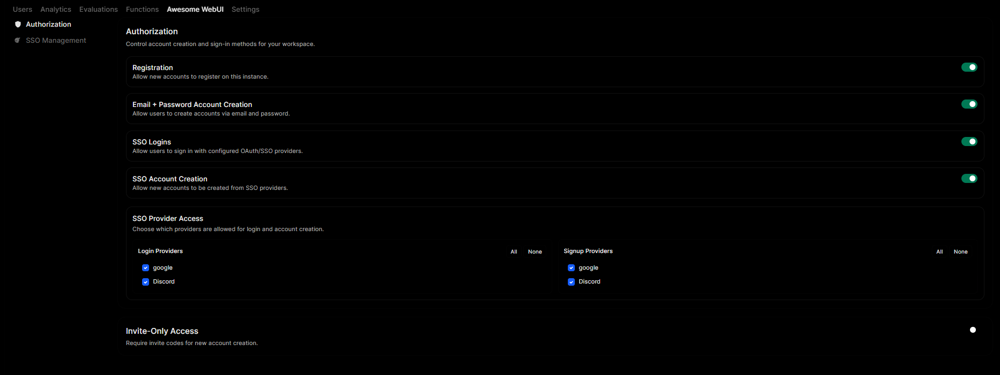
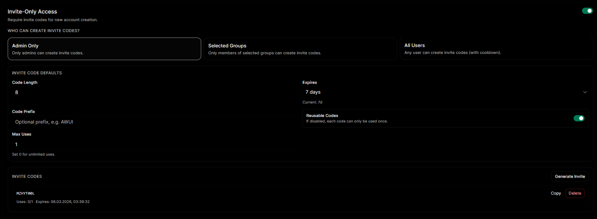
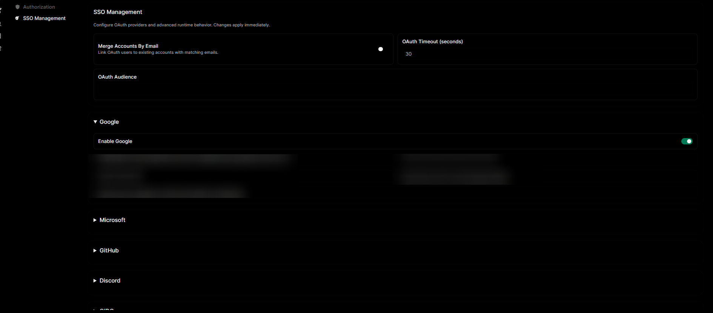
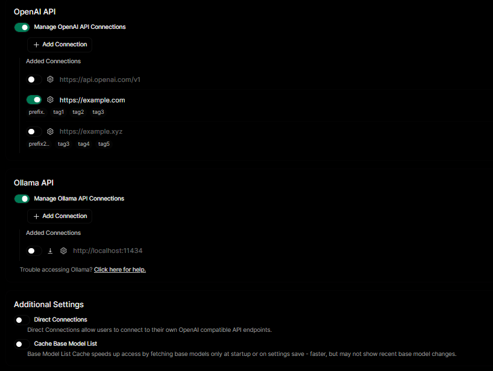
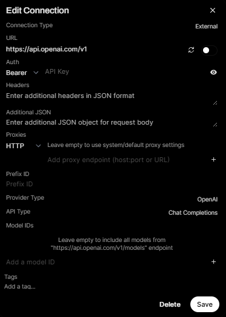

# Awesome WebUI 👋
>This `README.md` is also available in other languages:
<br>\- 🇺🇸 English <small>[You are currently here!]</small>
<br>\- 🇷🇺 [Русский](readme.ru.md)

> "I wish using Open WebUI sucked a little less!"

So, I am here to fix that. Awesome WebUI is a **fork** of [Open WebUI](https://github.com/open-webui/open-webui) focused on improving the experience for both admins and users. Let us get into the details.
<small>(hah, you see what I did there?)</small>

# List of Changes
## Admin Panel
### #1. Models Tab


```diff
+ Added the ability to multi-select models
+ Middle-clicking a model opens its editor in a new tab
+ Multi-select now supports bulk changes for icon, name, access, and enable/disable state
```

### #2. Awesome WebUI Tab (Authorization + SSO Management)

```diff
+ Added a dedicated "Awesome WebUI" admin tab with "Authorization" and "SSO Management" sections
+ Added auth method controls: Registration, Email+Password signup, SSO logins, and SSO account creation
+ Added provider-level SSO access control for login/signup with quick "All/None" actions
```

```diff
+ Added invite-only access controls with creator scope (Admin Only / Selected Groups / All Users)
+ Added invite defaults: code length, expiry presets + custom date/time, prefix, reusable toggle, and max uses
+ Added invite code management actions (generate, copy, delete)
```

```diff
+ Added full SSO Management for OAuth providers directly from admin UI
+ Added provider toggles and editable OAuth settings (Google, Microsoft, GitHub, Discord, OIDC, Feishu)
+ Added advanced OAuth runtime settings (merge by email, timeout, audience)
```

### #3. Connections Tab
<small>
* - "provider" is used here as another term for "connection".
<br>¹ - untested feature, please report any issues.
<br>² - using SOCKS proxies adds dependency: `aiohttp-socks`.
</small>


```diff
+ Split layout into 3 sections (OpenAI, Ollama, Additional Settings)
+ Added left-aligned "Add Connection" actions and clearer "Added Connections" list grouping
+ Made provider* base URLs clickable
+ Added preview of each provider's* tags and prefix
```

```diff
+ Added support for proxies (HTTP/SOCKS4/SOCKS5) for provider* connections¹²
+ Added support for additional JSON merged into requests
```

## TODO Roadmap
Planned improvements and QoL changes. If you want to suggest something for Awesome WebUI, [post an idea here](https://github.com/mehhovcki-dev/awesome-webui/discussions/categories/ideas).

Priority guide: `HIGH` (soon), `MEDIUM`, `LOW`, `XLOW` (later).

### Admin Panel
- [x] `HIGH` Invite-code system
- [x] `HIGH` Ability to change registration from the website (OAuth providers, etc.)
- [ ] `MEDIUM` System notice and MOTD
- [ ] `LOW` Custom emojis
- [ ] `LOW` Notification sounds for channels
- [x] `LOW` Discord OAuth

### User Interface
- [ ] `LOW` Add GIFs to channels
- [ ] `LOW` Notification changes for channels
- [ ] `LOW` Integrate GIF search with emojis and custom emojis

### General
- [ ] `?` Add migration support for files (such as DB) from default Open WebUI
- [ ] `XLOW` Add translations for new features
